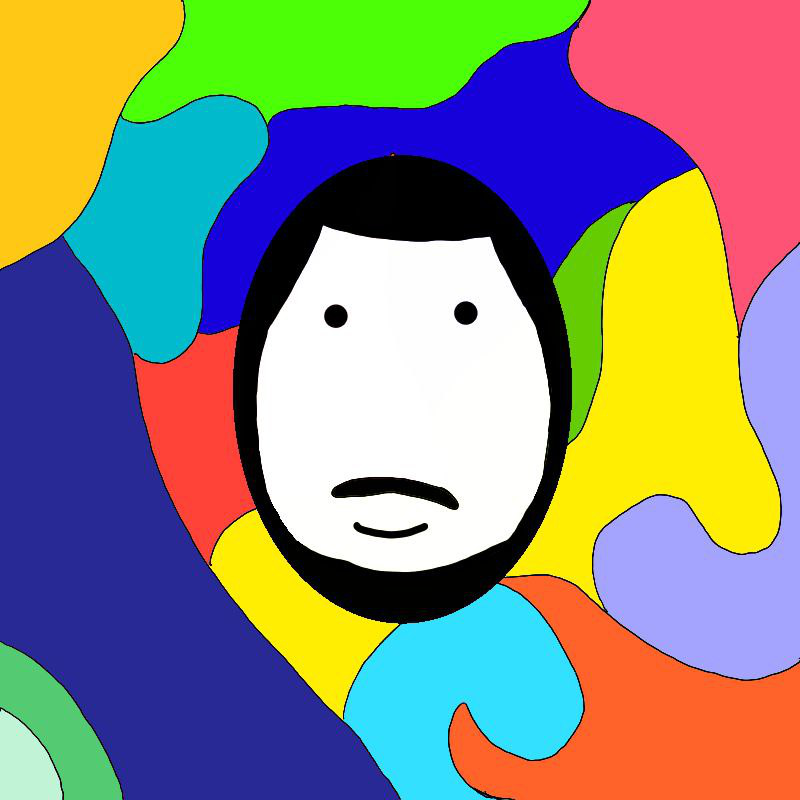

 

Physical Oceanographer, master's student in physical oceanography and remote sensing.

## About

  Physical oceanographer, currently working on my master's degree on identification of internal waves using CNN in SAR images.

 

## Languages

## GitHub Stats

  
  

 

## Contact

 
  
  
  
  
  

